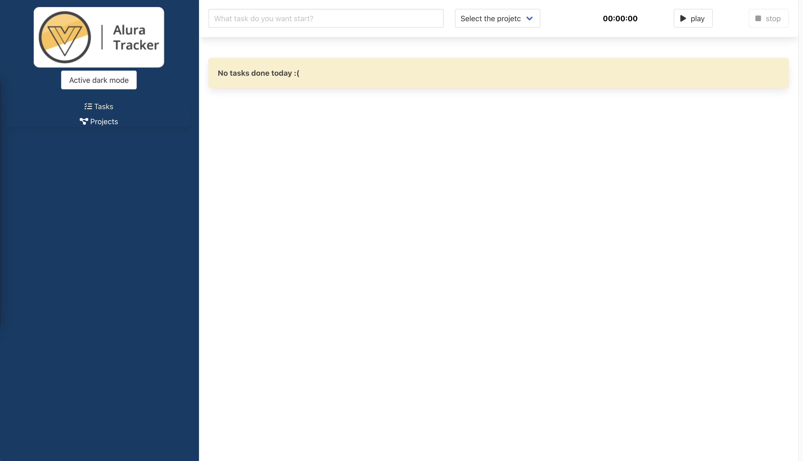

# vue-alura-tracker
Application developed with Vue.js 3 and Bulma, following the framework course at Alura.



## Project setup
```
npm install
```
```
npm install -g json-server
```

### Compiles and hot-reloads for development
```
npm run serve
```

### Compiles and minifies for production
```
npm run build
```

### Lints and fixes files
```
npm run lint
```

## Usage

### Run application
```
npm run serve
```

### Run json-server
```
json-server --watch db.json
```

### Open application
```
http://localhost:8080
```

### Links
- [Configuration Reference](https://cli.vuejs.org/config/).
- [Extension to debug on Chrome: Vue.js devtools](https://chrome.google.com/webstore/detail/vuejs-devtools/nhdogjmejiglipccpnnnanhbledajbpd?hl=pt-BR)
- [Json server documentation](https://github.com/typicode/json-server)
